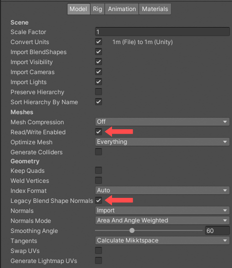
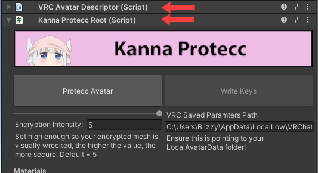
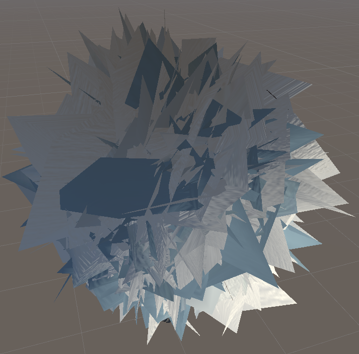

  
  

Fuck RipperStore!
This project was previously owned by rygo6. It has been passed on for me to own and work on.
This is the official repository for this project.

This is free. Actually read all of this.

NOTE: Rather pathetically, some are spreading the false rumor this has been bypassed. [It has not been bypassed](/Readme/FAQ.md). This is from the malicious scene to try to stop this becoming too common.

# Kanna Protecc

This is a rather invasive anti-avatar-ripping system to be used for VRChat. It will protect against your avatar being ripped, extracted and edited. It will also protect against your avatar being ripped and re-uploaded without edits.

This system will randomize all the vertices of your avatar's mesh, then write that to disk. Then rely on a custom shader with a 32 bit key to un-randomize the vertex positions in game. This is <b>not</b> done through blend shapes. Rather this will copy, and destructively edit, the 'Basis' layer of your mesh. It will also obfuscate pretty much everything else on your avatar to confusing as a extra middle finger for the ripper.

## Tutorial Video (Click The Image!)

  

## Contents

1. [Caveats of this System](#caveats-of-this-system)

1. [Supported Shaders](#supported-shaders)

1. [Simple Usage Instructions](#quick-start-guide)

1. [Testing in Unity](/Readme/ADVANCED.md/#testing-in-unity)

1. [FAQs](/Readme/FAQ.md)

1. [How secure is this?](#how-secure-is-this)

1. [Support](#support)

1. [Roadmap](#roadmap)

1. [Hall Of Shame](#hall-of-shame)

## Caveats of this System

1. For a user to see your avatar properly in VRChat, they must have your avatar fully shown. Shaders, animations and all. You are invisible otherwise.

2. This synchronizes the key with Avatar 3.0 parameters and does take up 32 bits. So this system can only work with avatars that use the VRChat Avatar 3.0 SDK.

3. Only a shader from [Supported Shaders](#supported-shaders) will work with this. To request another shader to be supported, feel free to ask in the discussions tab here, or in the discord, seen in the [Support](#support) section.

4. Proper integration with VRCFury is currently in development. 

## Supported Shaders

| Supported Shader Name  | Download |
| ------------- | ------------- |
| Poiyomi | https://github.com/poiyomi/PoiyomiToonShader |
| Unity-Chan Toon Shader (UTS) | https://unity-chan.com/download/releaseNote.php?id=UTS2_0&lang=en |
| Sunao Shader | https://booth.pm/ja/items/1723985 |
| XSToon | https://github.com/Xiexe/Xiexes-Unity-Shaders |
| GTAvaToon | https://github.com/rygo6/GTAvaToon |

---
## Quick Start Guide

 Click me! 

### Backup your project before running these operations in case it doesn't work properly and causes difficult to fix, or impossible to fix, changes in your project.

#### Really do it. Close Unity, and make a full clean copy of your entire Unity Project folder. A small percentage of avatars did have odd things in their mesh that just wouldn't work, or could cause errors, and the script could leave some assets in the project in a rather messed up state.

---

### Install Kanna Protecc and a supported shader

1. Ensure you are using latest [VRChat Avatars SDK](https://vrchat.com/).
2. Download the supported shader of your choice from [Supported Shaders](#supported-shaders), and import it into your Unity project.
3. Click ([Download](https://github.com/PlagueVRC/AntiRip/archive/refs/heads/main.zip)). Once downloaded, extract it. Once you have the folder, put that into your assets folder of your unity project.

---

### Prep Your FBX's.

Be sure all of this is set correctly on your FBX's. (Legacy blend shape normals and read/write on too!) 

---

### Setup Kanna Protecc Component.

1. Add the `KannaProteccRoot` component onto the root GameObject of your avatar, next to the `VRCAvatarDescriptor` component.

#### Materials Settings

Any additional materials that are used in animations etc that will be applied to an encrypted mesh should be added to 'Additional Materials'. Otherwise they will not be able to display the decoded mesh. Note these are things like material swaps. <b>DO NOT PUT NORMAL NON-ADDITIONAL MATERIALS IN HERE.</b>

Ignored Materials allows you to use a material with a supported shader on a part of your avatar you don't want encrypted. <b> Materials in this list will not be encrypted. Do not add materials to this list that are on parts of your avatar you want to protect. </b>

#### Custom Bit Key Length

You can change the 'BitKeys Length' under 'Debug' settings. This allows users with fewer parameters to spare to still use Kanna Protecc. However know that using a shorter bit key reduces the security of the encryption. Its recommended that you use as large of a 'BitKeys Length' as possible.

#### Obfuscator Settings

By default Kanna Protecc Obfuscates all objects, parameter names, and animator layers on a user's avatar. Features of VRChat that users may want to take advantage of. Such as contact senders, OSC integrations, etc, often require specific names to be unaltered to maintain functionality.

Kanna Protecc allows for exceptions to be added for renaming. For maximum security only add exceptions for parameters that are required to be unaltered. *Note that contact parameter names not intended to interact with other avatars will function perfectly fine obfuscated. Physbone parameters also function perfectly obfuscated. Neither need to be added to exceptions.*

[Examples for Face tracking and GoGoLoco.](/Readme/ADVANCED.md)

2. Ensure your `VRCAvatarDescriptor` has an AnimatorController specified in the 'FX Playable Layer' slot. Ensure there is also an `Animator` component on this root GameObject, and that its 'Controller' slot points to the same AnimatorController in the 'FX Playable Layer' slot on the `VRCAvatarDescriptor`. 

<b>The AnimatorController you specify should not be shared between multiple avatars, Kanna Protecc is going to write states into the controller which will need to be different for different avatars.</b>

3. In the 'Parameters' slot of your `VRCAvatarDescriptor` ensure you have an 'Expression Parameters' object.

---

### Delete your old Un-Encrypted Avatar from VRC Backend!

<b>VRC API stores old uploads of your avatar! So if you start uploading an encrypted avatar with an ID that you previously uploaded non-encrypted, it may entirely negate any benefit this provides as rippers can just download an older version that was not encrypted.</b>

1. Go into the VRChat SDK Inspector in the Unity Editor, then under 'Content Manager' find the avatar you wish to protect and delete it entirely from the VRC backend.
2. Go to your current avatar's `Pipeline Manager` component and click the `Detach (Optional)` button so it will generate a new avatar id on upload.

---

### Encrypting and Uploading

1. Ensure any meshes you wish to have encrypted are using a compatible shader, such as Poiyomi.
2. On the `KannaProteccRoot` component click the 'Protecc Avatar' button. This will produce a garbled version of your avatar with '_KannaProteccted' appended to the name. 

<b>The mesh appearing scrambled is intended behavior.</b>
3. Go to the VRChat SDK Menu then 'Build and Publish' your avatar which has '_KannaProteccted' appended to the name.

*I found some Poi 8/8.1 materials get into a weird state with Lock/Unlock and Kanna Protecc can't lock them. If you get errors that say something like 'Trying to Inject not-locked shader?!' go to the Poi 8/8.1 material it is complaining about and manually click the Lock/Unlock button to get it out of its weird state.*

---

### Writing Keys

<b>Ensure VRChat is closed! Otherwise when you write keys VRChat may prevent writing!</b>

1. <b>This is important.</b> After upload completes, go to the GameObject of your encrypted avatar. Find the `Pipeline Manager` component and copy it's blueprint ID. Then paste the blueprint ID into the `Pipeline Manager` on the un-encrypted avatar and click 'Attach'.
2. Now on the KannaProteccRoot component click the 'Write Keys' button. This will actually read in and alter the saved 3.0 parameters from your VRChat folder to include the new key so you don't have to enter them in-game. 
3. <b>Ensure no errors came up!. It should popup a success dialogue if it did it correctly. If there were issues make sure the 'Vrc Saved Params Path' actually points to your LocalAvatarData folder.</b>

You only need to run 'Write Keys' once on first setup, or when you change keys. 

<i>If you "Reset Avatar" in game through the 3.0 menu, it will reset your keys and you will need to re-export them with the 'Write Keys' button!</i>

---

### Un-Encrypting, Editing and Re-uploading Your Avatar

If you wish to see your avatar again as normal and not encrypted, or make changes to your avatar: 

1. Click on your original un-encrypted avatar, where "Encrypted" is not in the name; then select Un-Protecc Avatar.

You should now be able to edit your avatar as normal.

<b>Do not upload the avatar without encrypting it!</b>

3. Click 'Protecc Avatar' again. Follow the steps in [Encrypting and uploading](#encrypting-and-uploading)
4. Writing keys should not be necessary unless you genereated new keys.

---

### Testing the Avatar

You can also [test in Unity](/Readme/ADVANCED.md/#testing-in-unity).

---

[Back to Contents](#contents)

---

## How secure is this?

I will keep transparent here without guiding rippers on how to attack your works. This is not foolproof, but the best you can get at this time. Rip wise, this cannot be currently ripped without a insane amount of work, as ripping compiled shadercode, reversing it back to unity compatible code and also getting hold of the keys would be hell. Hotswap wise, a dedicated enough ripper with experience with mods could hotswap your avatar. This is not immune to that. (Soon to be countered with traps making even that extremely harder to do) You can however put a watermark on your avatar to drive hotswappers into being banned which they wont be able to remove, as the meshes will be encrypted, regardless of hotswap. A hotswap done with the high amount of work i have mentioned here would only get the avatar working normally in game; not in unity.

A typical hotswap will not bypass this. It would take a specialized one.

## Support

If you have any more questions, or suggestions, feel free to join the Kanna Protecc discord:
https://discord.gg/SyZcuTPXZA

## Roadmap

This will let you keep up to date with major features that will take time to implement. This does not act as a changelog, nor will it have every upcoming feature listed. Only time-consuming ones.
https://trello.com/b/k88bNBvd/kanna-protecc

## Hall Of Shame

People who lied claiming they could bypass this yet would never put their money where their mouth is, or just terrible people in general, such as contributors to the ripping scene.

Idiot dev of sars who claims he doesn't endorse ripping, meanwhile majority admins rip and AC outright told someone they can rip any avatar. Even in cool people role has people openly expressing they make and use crashers.

Proof of admin endorsing it:

https://github.com/PlagueVRC/AntiRip/assets/36628963/8fab7cab-ba16-4b34-b612-5481758c582f

Member of SARS community panicking at Kanna Protecc existing:

Soy boy
